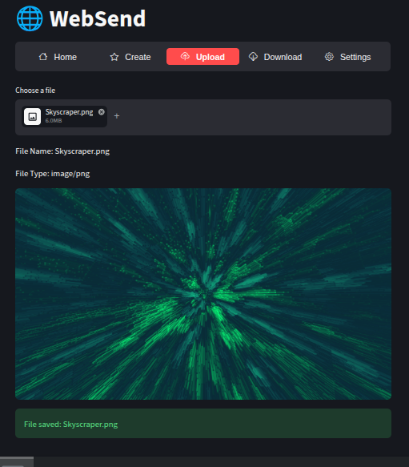
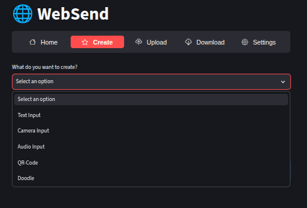

# 🌐 WebSend
A Streamlit based application for sending files to other devices through a web browser.

# ⚠️ IMPORTANT
**DO NOT USE THIS ON A PUBLIC WI-FI NETWORK, ANY FILES SENT TROUGH THIS APPLICATION WILL BE VISIBLE TO THE PUBLIC**

If you need to use this in a public environment, connect your computer and any device you want to share files with to a **password protected** mobile hot-spot.

You also should not deploy this application, their is a vary high chance that it wont work, keep it on your local machine.

# Download
On Linux:

0. See **IMPORTANT**
1. Run `'git clone https://github.com/S3b-sudo/WebSend'` in the terminal or download the code as a zip.
2. Run the install file with `'python install.py'`

On Windows:

¯\_(ツ)_/¯
Maybe try WSL? 

Run 'wsl --install' in powershell or google it if it changed.
Follow the Linux portion

## Run
To run the project run `'./run.sh'` and click the link provided by Streamlit if it doesn't open automatically.
 > If you get Permission denied. Run `'chmod +x run.sh'`

 > If you can't connect by scanning the qr code or typing the Network URL, try running `'python firewall_mgr.py'`

## Screenshots

Navigation Bar

Upload Page

File creation options

## Notes
This was the first actually useful web based tool i created (even if it is a Streamlit project and not an actual website).
For now, there is an upload limit because my computer has vary low storage. You can overwright it by adding `--server.maxUploadSize [MB]` to the run.sh file.
